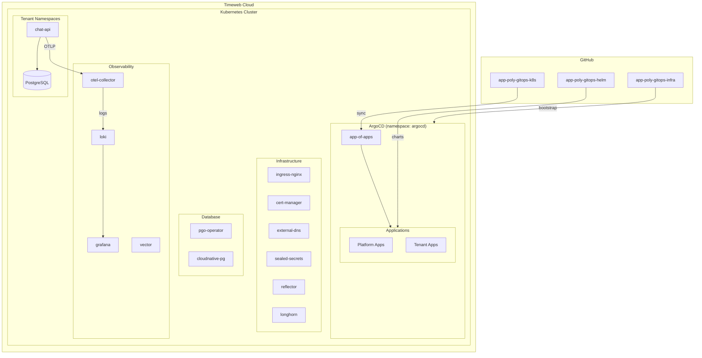

# Architecture

## Overview

GitOps-платформа на базе ArgoCD с App-of-Apps паттерном для управления Kubernetes кластером.

## Diagram



## Repository Structure

```
app-poly-gitops-k8s/
├── clusters/                    # Environment entry points
│   ├── dev/
│   │   ├── kustomization.yaml   # Assembles all resources
│   │   └── destination.yaml     # Cluster name patch
│   └── prd/
│       └── ...
├── platform/                    # Platform components
│   ├── core/
│   │   ├── namespaces/          # Namespace definitions
│   │   └── cluster-bootstrap/   # app-of-apps root
│   ├── infrastructure/
│   │   ├── networking/          # nginx, cert-manager, external-dns
│   │   ├── security/            # sealed-secrets, reflector, external-secrets
│   │   ├── storage/             # longhorn
│   │   ├── database/            # pgo, cloudnative-pg
│   │   └── ai-platform/         # open-webui
│   ├── observability/
│   │   ├── monitoring/          # loki, grafana
│   │   └── opentelemetry/       # otel-collector
│   └── gitops/
│       └── argocd-image-updater/
├── tenants/                     # Team applications
│   └── product-team/
│       └── apps/
│           └── chat/
│               ├── base/        # Base application
│               └── overlays/    # Environment overrides
│                   └── dev/
└── policies/                    # OPA Rego policies
```

## Data Flow

### GitOps Sync

```
Developer Push → GitHub → ArgoCD Sync → Kubernetes Apply
                              ↑
              argocd-image-updater (auto-update images)
```

### Observability Pipeline

```
chat-api (OpenTelemetry SDK)
    ↓ OTLP/gRPC
otel-collector (receiver → processor → exporter)
    ↓ Loki API
loki (log storage)
    ↓ LogQL
grafana (visualization)
```

### Secret Management

```
SealedSecret (encrypted in git)
    ↓ sealed-secrets controller
Secret (decrypted in cluster)
    ↓ reflector
Secret (replicated to other namespaces)
```

## Sync Waves

Порядок деплоя контролируется через `argocd.argoproj.io/sync-wave`:

| Wave | Components |
|------|------------|
| 0 | Namespaces |
| 1 | CRD Operators (cert-manager, sealed-secrets, longhorn, cloudnative-pg) |
| 2 | ClusterIssuers, StorageClasses |
| 3 | Secrets, ConfigMaps, Ingresses |
| 5 | Applications (chat-api) |

## Component Details

### CloudNativePG

Простой PostgreSQL оператор для dev окружений:

```yaml
apiVersion: postgresql.cnpg.io/v1
kind: Cluster
metadata:
  name: chat-db-cnpg
spec:
  instances: 1
  storage:
    storageClass: longhorn
    size: 5Gi
  bootstrap:
    initdb:
      database: chat
      owner: chatapi
```

Создаёт секрет `<cluster-name>-app` с ключами:
- `uri` — полный connection string
- `host`, `port`, `dbname`, `user`, `password`

### OpenTelemetry Collector

Принимает OTLP traces/logs и отправляет в Loki:

```yaml
receivers:
  otlp:
    protocols:
      grpc:
        endpoint: 0.0.0.0:4317
      http:
        endpoint: 0.0.0.0:4318

exporters:
  loki:
    endpoint: http://loki.monitoring:3100/loki/api/v1/push
```

### Reflector

Реплицирует секреты между namespaces через аннотации:

```yaml
annotations:
  reflector.v1.k8s.emberstack.com/reflection-allowed: "true"
  reflector.v1.k8s.emberstack.com/reflection-allowed-namespaces: "cert-manager"
  reflector.v1.k8s.emberstack.com/reflection-auto-enabled: "true"
  reflector.v1.k8s.emberstack.com/reflection-auto-namespaces: "cert-manager"
```
